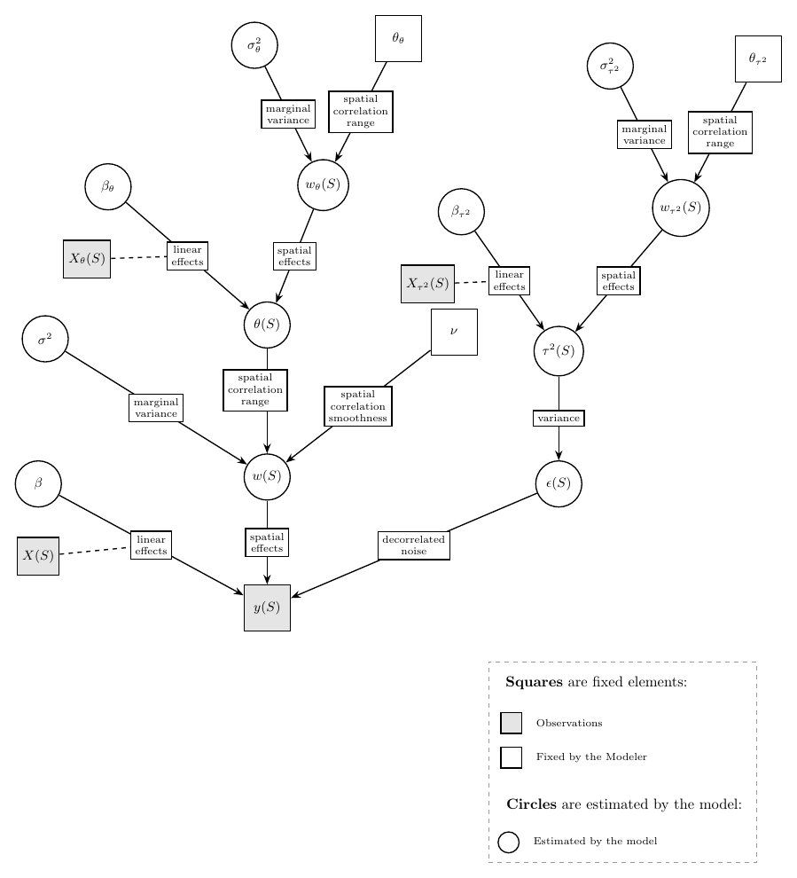

```{r, include = FALSE}
set.seed(1)
knitr::opts_chunk$set(
    collapse = TRUE,
    comment = "#>"
)
options(warn=-1)
```

# Small working example

```{r}
library(GeoNonStat)
dataset <- readRDS("Data4vignettes/smallExample.RDS")
# Setup
vecchia_approx <- createVecchia(dataset$locs, m=6)
PP_range = createPP(vecchia_approx, matern_range = .5)
PP_noise = createPP(vecchia_approx, matern_range = .2)
geo_non_stat = GeoNonStat(
  observed_field = dataset$observed_field, # response
  vecchia_approx = vecchia_approx, # Vecchia approximation
  X = dataset$X, # explanatory variables for the response 
  noise_X = dataset$noise_X, noise_PP = PP_noise,  # explanatory variables and PP for the nonstationary noise variance 
  range_PP = PP_range # PP for the nonstationary range 
)
# Running the model (with very low ESS and Gelman Rubin targets)
future::plan(strategy = "multisession", workers = 2)
geo_non_stat <- automaticMcmc(
  geo_non_stat, n_chains_in_parallel = 2, n_threads_per_chain = 3, satisfying_ESS = 10, satisfying_Gelman_Rubin = 10)
# Investigating MCMC 
tracePlots(geo_non_stat, keep = "field_log_var")
mcmcDiags(geo_non_stat)

```

# Model structure

The aim of GeoNonStat is to perform Bayesian non-stationary geostatistical modeling.

## Model construction

The model is a hierarchical model with several layers.
This section explains what kind of data can be analyzed with the proposed model.

The data is decomposed as $$y(s) = x(s)^T\beta + w(s) + \epsilon(s),$$

- $s$ being a spatial coordinate in 2D,
- $y(s)$ being a univariate continuous response variable at the coordinate $s$,
- $x(s)$ being a vector of explanatory variables at the coordinate $s$,
- $\beta$ being a vector of regression coefficient,
- $w(s)$ being an uni-variate Gaussian process term at the coordinate $s$ who captures the spatial auto-correlation of the data,
- $\epsilon(s)$ being an uni-variate noise term at the coordinate $s$.

Measurements are done in several coordinates $S = (s_1, \ldots, s_n)$, and having several observations within the same spatial site is possible.

Both $w(s)$ and $\epsilon(s)$ are nonstationary: their behavior may change following the coordinate $s$ and some explanatory variables.

### Regression model for the explanatory variables

It works like an usual linear regression model, in lm() for example.
The estimates or confidence intervals may change with respect to an usual linear model due to the Gaussian process.

### Nonstationary Gaussian Process to capture spatial auto-correlation

#### Tl;dr

- The latent field $w(S)$ has a smoothness parameter that is chosen by the modeler.
- The spatial correlation range and marginal variance are estimated by the model
- The modeler choses if $w(S)$ is (locally) isotropic or anisotropic.
- The modeler also choses if the range of $w(S)$ is allowed to change, in which case $w(S)$ is nonstationary.
- If $w(S)$ is nonstationary:
  - Explanatory variables $x_\theta(s)$ can explain the range, and they must be highly coherent spatially.
  - A latent field $w_\theta(s)$ can capture the spatial coherence of the range, and it must be highly coherent spatially too.

#### Gaussian Process model for $w$

The Gaussian process is specified through a *Gaussian Process* who guarantees its spatial coherence.
$$w(S) \sim \mathcal{N}\left(0,~\sigma^2~M(S, \theta(S), \nu)\right)$$

While the mean of $w(S)$ is null to avoid identifiability problems with the regression model, its covariance matrix is decomposed into two components:

- $\sigma^2$ is the marginal variance parameter, that is $Var(w(s_1)) = \ldots = Var(w(s_n)) = \sigma^2$.
- $M(S, \theta(S),\nu)$ is the correlation matrix of $w(S)$. It depends on three things:
  - Spatial coordinates $S$. Roughly, the closer $s_i$ and $s_j$ are, the more correlated $w(s_i)$ and $w(s_j)$.
  - Spatial correlation range parameters $\theta(S)$, who control the local correlations structure of $w(S)$. Those parameters are the reason why $w(S)$ is nonstationary (or not).
  - A smoothness parameter $\nu$ who can take value $0.5$ or $1.5$. If $\nu=0.5$, the spatial field will be a bit rougher.

#### Range and smoothness of the Gaussian process

Imagine $w(S)$ as a landscape of hills.
The width of the hills is controlled by the range $\theta$, and their roughness is controlled by the smoothness $\nu$.
The smoothness is an important parameter, but it is very difficult to identify with the range, so the smoothness is set by the user to $0.5$ or $1.5$.

```{r, echo=FALSE, message=FALSE, results='hide'}
observed_locs = as.matrix(expand.grid(seq(0, 1, .005), seq(0, 1, .005)))
vecchia_approx = createVecchia(observed_locs, m = 6)
PP_range = createPP(vecchia_approx, matern_range = .5, plot = F)
field_log_var=  0
range_log_scale = c(0, 0)
noise_intercept = -2

par(mfrow  =c(2,2))
for(nu in c(.5, 1.5)){
  gns_simulator = createGnsSimulator(
    vecchia_approx = vecchia_approx,
    range_PP = PP_range,
    anisotropic = T, matern_smoothness = nu
  )
  rangevalues = c(-4, -2)
  for(beta0 in rangevalues){
    set.seed(1)
    coeff_list = createGnsSimulatorParameters(
      gns_simulator, range_PP_log_var =range_log_scale,
      noise_intercept = noise_intercept, noise_PP_log_var = noise_PP_log_var,
      verbose = F, field_log_var = field_log_var)
    coeff_list$range_X_coeff[1,1] = beta0
    coeff_list$range_PP_coeff[] = 0
    fake_data = simulateGnsData(gns_simulator = gns_simulator, gns_params = coeff_list)
    plotPointillistPainting(
      vecchia_approx$locs, fake_data$hidden_fields$latent_field, cex= .5,
      pch= 15, main = paste("w with", c("small", "big")[match(beta0, rangevalues)], "range,", c("small", "big")[match(nu, c(.5, 1.5))], "smoothness"), legend = F)
    print(nu)
    print(beta0)
  }
}
```

#### Spatial variation of the range parameter

Now imagine that our landscape behaves differently following the region and/or some explanatory variables.
The range parameters of the Gaussian process are decomposed as: $$log(\theta(s)) = x_\theta(s)^T\beta_\theta +  w_\theta(s)$$

- $s$ being a spatial coordinate in 2D,
- $x_\theta(s)$ being a vector of explanatory variables at the coordinate $s$,
- $\beta_\theta$ being a vector of regression coefficient,
- $w_{\theta}(s)$ being an Gaussian process term at the coordinate $s$ who enforces some spatial coherence on $\theta$.

This differs from the decomposition of the data by the fact that there is no noise.

The spatial coherence on $w_\theta$ is enforced by a Gaussian Process, with distribution: $$w_\theta(S) \sim \mathcal{N}\left(0,~\sigma^2_\theta~M(S,\theta_\theta,\nu = 1.5)\right)$$

- $\sigma^2_\theta$ is the marginal variance parameter.
- $M(S,\theta_\theta,\nu = 1.5)$ is the correlation matrix of $w(S)$. Now,
  - The range $\theta_\theta$ is constant and chosen by the modeler
  - The smoothness $\nu$ is set to $1.5$.

So one parameter ($\theta_\theta$) is user-chosen, and one ($\sigma_\theta$) is estimated by the model.

For the sake of identifiability, the spatial coherence of $\theta(S)$ must be much higher than the spatial coherence of $w(S)$.
There are two practical consequences to that:

- $\theta_\theta$ must be big,
- $x_\theta$ must be really smooth and spatially coherent.

When $x_\theta$ is just an intercept, and $\sigma^2_\theta$ is constrained to $0$, then $\theta(S)$ is constant and the model boils down to a stationary model.

```{r, echo=FALSE, message=FALSE, results='hide', fig.width=7, fig.height=3.5}
par(mfrow  =c(1,2))
  for(nonstationary in c(FALSE, TRUE)){
    set.seed(1)
    coeff_list = createGnsSimulatorParameters(
      gns_simulator, range_PP_log_var =range_log_scale,
      noise_intercept = noise_intercept, noise_PP_log_var = noise_PP_log_var,
      verbose = F, field_log_var = field_log_var)
    coeff_list$range_X_coeff[1,1] = -4
    coeff_list$range_PP_coeff[,-1] = 0
    coeff_list$range_PP_coeff[,1] = nonstationary * rnorm(length(coeff_list$range_PP_coeff[,1]))
    fake_data = simulateGnsData(gns_simulator = gns_simulator, gns_params = coeff_list)
    plotPointillistPainting(
      vecchia_approx$locs, fake_data$hidden_fields$latent_field, cex= .5,
      pch= 15, main = paste("w when the range is", c("stationary", "nonstationary")[1+nonstationary]), legend = F)
    print(nu)
    print(beta0)
  }
```

#### Local isotropy or anisotropy of the Gaussian process

When the correlation of the Gaussian process does not change with spatial orientation, the field is isotropic.
If not so, the field is anisotropic.
The range parameter of an anisotropic field is an ellipse, which is equivalent to a positive-definite matrix.
When the field is isotropic, the ellipse boils down to a circle: the isotropic case is just a particular case of the anisotropic case.

```{r, echo=FALSE, message=FALSE, results='hide', fig.width=7, fig.height=3.5}
par(mfrow  =c(1,2))
for(aniso in c(FALSE, TRUE)){
  for(nonstationary in c(FALSE)){
    set.seed(1)
    coeff_list = createGnsSimulatorParameters(
      gns_simulator, range_PP_log_var =range_log_scale,
      noise_intercept = noise_intercept, noise_PP_log_var = noise_PP_log_var,
      verbose = F, field_log_var = field_log_var)
    coeff_list$range_X_coeff[1,1] = -4
    coeff_list$range_X_coeff[1,2] = .3*aniso
    coeff_list$range_X_coeff[1,3] = -.6*aniso
    coeff_list$range_PP_coeff[] = rnorm(length(coeff_list$range_PP_coeff[]))*nonstationary
    fake_data = simulateGnsData(gns_simulator = gns_simulator, gns_params = coeff_list)
    plotPointillistPainting(
      vecchia_approx$locs, fake_data$hidden_fields$latent_field, cex= .5,
      pch= 15, main = paste("w when the range is", c("isotropic", "anisotropic")[1+aniso]), legend = F)
    print(nu)
    print(beta0)
  }
}
```

In anisotropic settings, $\theta(s)$ is a positive-definite matrix.
The model can be anisotropic and nonstationary, with both the correlation range and direction evolving across space.
The previous decomposition, using the logarithm, is replaced by a decomposition who uses the matrix logarithm $mlog(\cdot)$.
The matrix logarithm of a positive-definite matrix is a symmetric matrix.
The symmetric matrices are modeled using the basis: $$e_{range} = \begin{pmatrix} \sqrt 2 & 0 \\ 0 & \sqrt 2 \end{pmatrix}, e_{aniso}^1 = \begin{pmatrix} \sqrt 2 & 0 \\ 0 & -\sqrt 2 \end{pmatrix}, e_{aniso}^2 = \begin{pmatrix} 0 & \sqrt 2 \\ \sqrt 2 & 0 \end{pmatrix}.$$ The choice of the matrix basis used to decompose $mlog(\theta(s))$ is not arbitrary:\
$e_{range}$ controls the ellipse size, while the other two components control its shape only.
Changing $e_{range}$ will inflate or deflate the ellipses, while changing the two other components will squash the ellipses while leaving their size invariant.

So now, instead of having one component to model, we have three components:

$$\log(\theta(s)) = \big(x_\theta(s)^T\beta_{range} + w_{range}(s)\big)\, e_{range} + \big(x_\theta(s)^T\beta_{aniso}^1 + w_{aniso}^1(s)\big)\, e_{aniso}^1 + \big(x_\theta(s)^T\beta_{aniso}^2 + w_{aniso}^2(s)\big)\, e_{aniso}^2.$$ There are therefore three times more parameters than in a locally isotropic model.

The spatial coherence on $w_{range}, w_{aniso}^1, w_{aniso}^2$ is enforced by a Gaussian Process, with distribution: $$w_{range}(S) \sim \mathcal{N}\left(0,~\sigma_{range}^2~M(S,\theta_\theta,\nu = 1.5)\right); \quad w_{aniso}^1(S), w_{aniso}^2(S) \sim \mathcal{N}\left(0,~\sigma_{aniso}^2~M(S,\theta_\theta,\nu = 1.5)\right)$$ All three components share the same correlation matrix, but they have different variance parameters depending on their role in the decomposition of the range ellipses.
If $\sigma^2_{range}$ is big, then the ellipses will vary in size.
$\sigma^2_{aniso}$ is big, then the ellipses will vary in shape and direction.
The impact of that on $w$ can be seen in the figure below.

```{r, echo=FALSE, message=FALSE, results='hide'}
par(mfrow  =c(2,2))
for(sigma_range in c(.01, 1)){
  for(sigma_aniso in c(.01, 1)){
    set.seed(1)
    coeff_list = createGnsSimulatorParameters(
      gns_simulator, range_PP_log_var =range_log_scale,
      noise_intercept = noise_intercept, noise_PP_log_var = noise_PP_log_var,
      verbose = F, field_log_var = field_log_var)
    coeff_list$range_X_coeff[1,1] = -4
    coeff_list$range_X_coeff[1,2] = .3*aniso
    coeff_list$range_X_coeff[1,3] = -.6*aniso
    coeff_list$range_PP_coeff[,1] = rnorm(length(coeff_list$range_PP_coeff[,1]))*sigma_range
    coeff_list$range_PP_coeff[,-1] = rnorm(length(coeff_list$range_PP_coeff[,-1]))*sigma_aniso
    fake_data = simulateGnsData(gns_simulator = gns_simulator, gns_params = coeff_list)
    range_label = ifelse(sigma_range == .01, "small", "big")
    aniso_label = ifelse(sigma_aniso == .01, "small", "big")
    plot_main = bquote("w when"~ sigma[range] ~ "is" ~ .(range_label) * "," ~ sigma[aniso] ~ "is" ~ .(aniso_label))

    plotPointillistPainting(
      vecchia_approx$locs, fake_data$hidden_fields$latent_field, cex = .5,
      pch = 15, legend = F, main = plot_main)
  }
  }
```

### Nonstationary model for the noise

The variance of the noise $\tau^2(s)$ plays the same role as in a simple linear model, but it may depend on explanatory variables and/or the spatial location.
The resulting noise is then heteroskedastic.
The decomposition is

$$log(\tau^2(s)) = x_{\tau^2}(s)^T\beta_{\tau^2} +  w_{\tau^2}(s),$$

- $s$ being a spatial coordinate in 2D,
- $x_{\tau^2}(s)$ being a vector of explanatory variables at the coordinate $s$,
- $\beta_{\tau^2}$ being a vector of regression coefficient,
- $w_{\tau^2}(s)$ being an Gaussian process term at the coordinate $s$ who enforces some spatial coherence on $\tau^2$.

The spatial coherence on $w_{\tau^2}$ is enforced by a Gaussian Process, with distribution:

$$w_{\tau^2}(S) \sim \mathcal{N}\left(0,~\sigma^2_{\tau^2}~M(S,\theta_{\tau^2},\nu = 1.5)\right)$$

Contrary to the range, $\tau^2$ does not need to be spatially coherent.
Any explanatory variable can go into $x_{\tau^2}(s)$, and the range $\theta_{\tau^2}$ can be small.

### Model architecture: putting all the above together

#### Graphical representation

Putting all the elements together, we get the following model architecture.



#### Russian doll structure

The Modeler can choose simpler models who are encompassed in the "full monty'' model above.

- The Modeler can cancel $w_\theta$ and/or $w_{\tau^2}$.
- The Modeler can provide no variable for $x_\theta$ and/or $x_{\tau^2}$.
- If the Modeler cancels both $w_\theta$ and $x_\theta$, then $w$ is stationary.
- Similarly, if the Modeler cancels both $w_{\tau^2}$ and $x_{\tau^2}$, then $\epsilon$ is stationary.
- An anisotropic model is more general than a locally isotropic model.
- An overspecified model will tend to regress towards a simpler model if presented stationary data. This can be detected if $\sigma_{\tau^2}^2$ and/or $\sigma_{\tau^2}^2$ go to very small values. Also, if an anisotropic model is presented isotropic data, then $\sigma_{amiso^2}$ will go to very small values. Should those situations happen, it is better to restart the model with a simpler formulation.

## Model use

Once the model has run, we can get estimates, and then use those estimates to perform prediction at un-obsered spatial sites.
Those estimations and predictions can be used to compare models.

### Estimation

#### Analysis of the response variable $y(S)$

- Fixed effects: estimates and credibility intervals of the regression coefficients $\beta$ are obtained, allowing to interpret the effect of the explanatory variables $x(S)$ on the response variable $y(S)$.
- Gaussian process: estimates and credibility intervals of the Gaussian process $w(S)$ are obtained. This allows to understand the spatially coherent patterns in the response $y(S)$, and in particular to construct a map of the Gaussian process at the observed sites.
- Denoising: by combining estimates of $\beta$ and $w(S)$, we can obtain $x(S)\beta + w(S)$, which denoises $y(S)$ by removing $\epsilon(s)$

#### Analysis of the noise variance $\tau^2(S)$

- Fixed effects: estimates and credibility intervals of the regression coefficients $\beta_{\tau^2}$ are obtained, allowing to interpret the effect of the explanatory variables $x_{\tau^2}(S)$ on the noise variance.
- Gaussian process: estimates and credibility intervals of the Gaussian process $w_{\tau^2}(S)$ are obtained. This allows to understand the spatially coherent patterns in the the noise variance, and in particular to construct a map of the Gaussian process at the observed sites.
- Reconstitution of the heteroskedastic noise variance $\tau^2(S)$ at the observed sites using fixed and Gaussian process.

#### Analysis of the spatial correlation range $\theta(S)$

- Fixed effects: estimates and credibility intervals of the regression coefficients $\beta_{\theta^2}$ are obtained, allowing to interpret the effect of the explanatory variables $x_{\theta^2}(S)$ on the spatial correlation range.
- Gaussian process: estimates and credibility intervals of the Gaussian process $w_\theta(S)$ are obtained. This allows to understand the spatially coherent patterns in the the spatial correlation range, and in particular to construct a map of the Gaussian process at the observed sites.
- Reconstitution of the spatial correlation range $\theta^2(S)$ at the observed sites using fixed and Gaussian process.

### Prediction

If a new spatial coordinate $s'$ is given, and that the explanatory variables $x(s')$, $x_{\theta}(s')$, and $x_{\tau^2}(s')$ are observed at the new spatial site, the following can be predicted, with a posterior mean and credible intervals.

- Linear effects $x(s')^T\beta$.
- The spatial correlation range parameters $\theta(s')$.
- In turn, the latent field $w(s')$ can be computed.
- Using $x(s')$ and $w(s')$, the denoised interest variable can be computed.
- The variance of the heteroskedastic noise $\tau^2(s')$.
- The interest variable $y(s')$ can then be computed from all the above.

# Full workflow

## Model setup

#### Loading and exploring the data

The data set is loaded and its variables can be plotted.

```{r}
dataset <- readRDS("Data4vignettes/smallExample.RDS")
plotPointillistPainting(locs = dataset$locs, field = dataset$observed_field)
```

#### Train-test partition

The data is split between train and test data with two types of test data:

- Close to train data in order to evaluate short range interpolation
- Far from train data to evaluate long range interpolation. Some data is removed to leave a gap between train and test.

```{r}
split_dataset <- splitData(
  locs = dataset$locs, 
  data = list(observed = dataset$observed_field, 
              X = dataset$X, noise_X = dataset$noise_X))
split_dataset
```

#### Vecchia approximation setup

This builds the graphical model used throughout the analysis.

```{r}
vecchia_approx <- createVecchia(split_dataset$train$locs)
```

#### Gaussian Processes for nonstationary model parameters

The Gaussian priors for $w_{\tau^2}$ and $w_{\theta}$ are defined by the user, with an user-chose range parameter.
The vecchia approximation defined before is used.

The process is a low rank Predictive Process.
The number and placement of knots can be chosen by the user or automatically selected from the chosen range.
The placement of knots, approximation error, and some samples from the obtained Predictive Process distribution are graphically represented.

```{r}
range_PP <- createPP(vecchia_approx = vecchia_approx, matern_range = .5)
```

The noise variance parameter can have a PP with a smaller range.

```{r}
noise_PP <- createPP(vecchia_approx = vecchia_approx, matern_range = .2)
```

#### Model initialization

All the elements are put together in the function GeoNonStat to create a model of class GeoNonStat.
We start with a stationary model.

```{r}
vanilla_model <- GeoNonStat(
  vecchia_approx = vecchia_approx,
  observed_field = split_dataset$train$observed, # response
  X = split_dataset$train$X, # explanatory variables
  matern_smoothness = 1.5, anisotropic = F, # GP options
  range_PP = NULL, range_X = NULL, # nonstationary range model
  noise_PP = NULL, noise_X = NULL, # nonstationary noise model
  n_chains = 3 # number of MCMC chains
  )
summary(vanilla_model)
```

Then we create a model with nonstationary noise.

```{r}
heteroskedastic_model <- GeoNonStat(
  vecchia_approx = vecchia_approx,
  observed_field = split_dataset$train$observed, # response
  X = split_dataset$train$X, # explanatory variables
  matern_smoothness = 1.5, anisotropic = F, # GP options
  range_PP = NULL, range_X = NULL, # nonstationary range model
  noise_PP = noise_PP, noise_X = split_dataset$train$noise_X, # nonstationary noise model
  n_chains = 3 # number of MCMC chains
  )
summary(heteroskedastic_model)
```

Then we create a model with nonstationary noise and range.

```{r}
full_monty_model <- GeoNonStat(
  vecchia_approx = vecchia_approx,
  observed_field = split_dataset$train$observed, # response
  X = split_dataset$train$X, # explanatory variables
  matern_smoothness = 1.5, anisotropic = F, # GP options
  range_PP = range_PP, range_X = NULL, # nonstationary range model
  noise_PP = noise_PP, noise_X = split_dataset$train$noise_X, # nonstationary noise model
  n_chains = 3 # number of MCMC chains
  )
summary(full_monty_model)
```

## Running the model

#### Running MCMC

Several MCMC chains are run. 
We implemented a function who stops automatically when all ESS and Gelman diagnostics reach a satisfying value (nby default 100 for the ESS and 1 for Gelman diagnostics, the Gelman diagnostics being rounded to the first decimal upon computation).
Parallelization is possible on two levels:

- Over chains, using the R future multisession framework 
- Within each chain, using some Rcpp low-level parallelization and openBLAS if installed. 

```{r}
 future::plan(strategy = "multisession", workers = 3)

vanilla_model <- automaticMcmc(object = vanilla_model, n_chains_in_parallel = 3, n_threads_per_chain = 8, satisfying_Gelman_Rubin = 1.0, satisfying_ESS = 100, burn_in = .3,
iter_per_step =  500) 
 
heteroskedastic_model <- automaticMcmc(object = heteroskedastic_model, n_chains_in_parallel = 3, n_threads_per_chain = 8)
 
full_monty_model <- automaticMcmc(object = full_monty_model, n_chains_in_parallel = 3, n_threads_per_chain = 8)
```


#### Monitoring MCMC

```{r}
tracePlots(object)
```
## 
